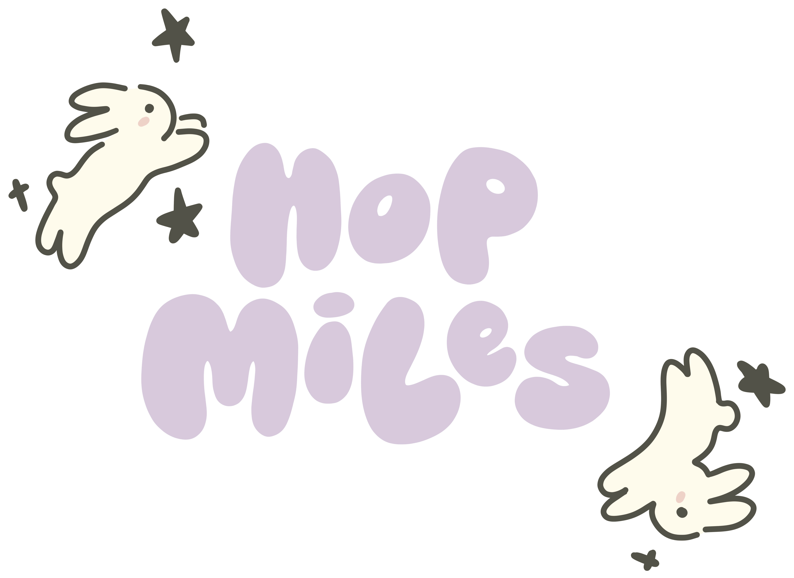
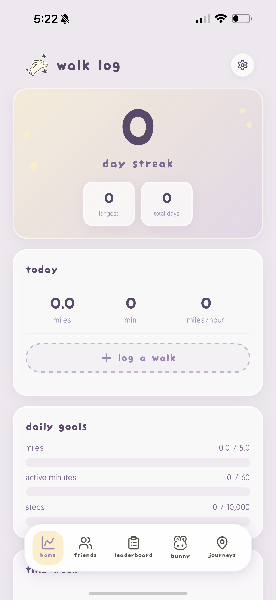
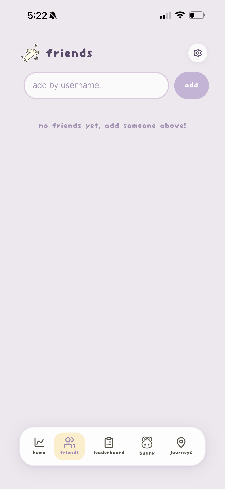
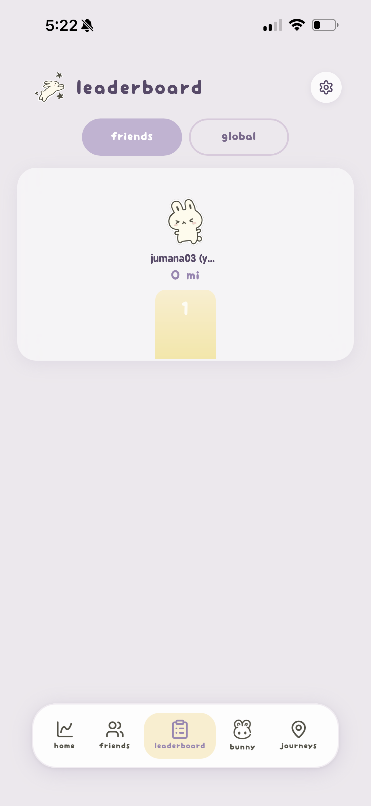
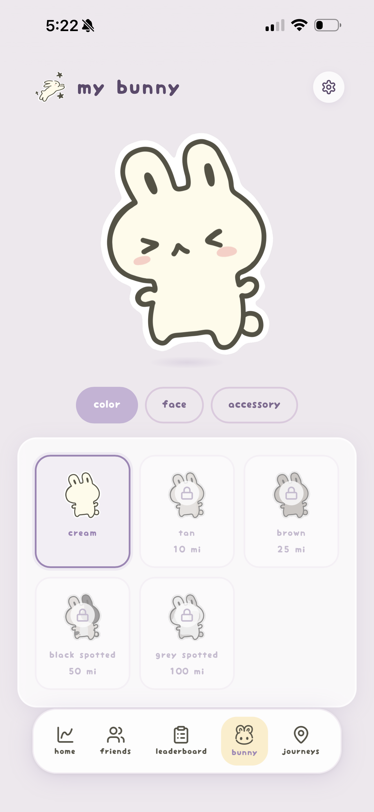
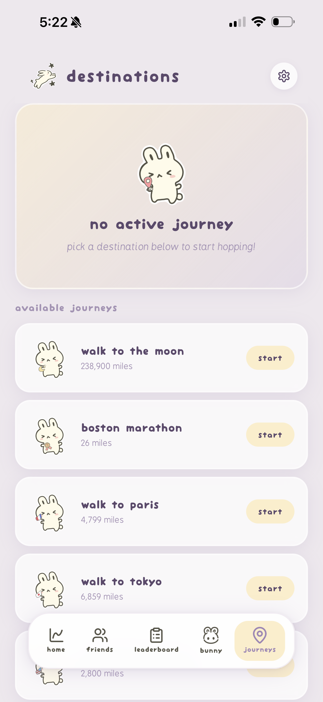
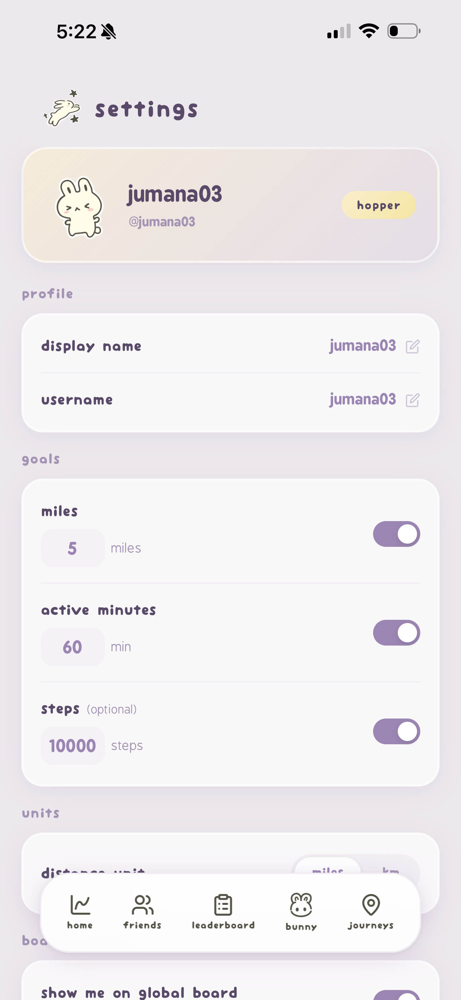

 

 
www.hopmiles.com

# 🐇 About Hop Miles

Hop Miles is a **walking and running tracker** web app with a cute design. Track your walks, dress up your bunny companion, compete with friends on leaderboards, and virtually walk to real-world destinations.

### Features
- **Walk/Run Logging** Track distance, duration, and active minutes
- **My Bunny** Dress up your bunny 
- **Friends** View friends' bunnies, stats, and recent activity
- **Leaderboard** Compete with friends and globally
- **Virtual Destinations** Walk to Paris, Tokyo, and more 

---

## Screenshots

### Intro & Sign In

### Home

### Friends

### Leaderboard

### My Bunny

### Destinations

---

## Mobile Views

---

## PWA Mobile View

---

## 🛠 Development & Versions

# 📜 Version History

| Version | Date | Highlights |
|---------|------|------------|
| **BETA** | Apr 2026 | Initial public release |
| | | User authentication |
| | | Walk/Run Logging |
| | | Bunny Customization |
| | | Friends & Stats |
| | | Leaderboard |
| | | Virtual Destinations |
---

*Hop Miles Beta*

